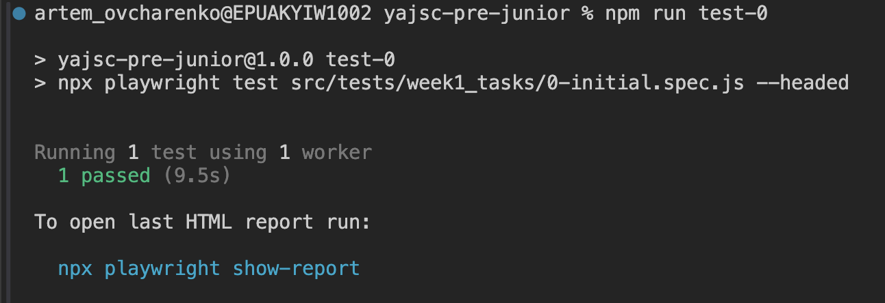

# YAJSC-PRE-JUNIOR

Pre-Junior framework and course tasks to get an overview of what JS is and how automated tests look like.

## Requirements

* You should have any git client installed
* NodeJS 20 or higher
* VSCode

## Setup

```bash
npm install
```

```bash
npx playwright install chromium --with-deps
```

```bash
npm run test-0
```

You should see the next picture in case of success:


## To verify the specific task

Run the command below substituting `<unit_number>` with the actual number (e.g. 1, 2, 11, etc.) of spec file you want to launch:

```bash
npm run test-<unit_number>
```

You may find the list of the scripts in the `package.json` file, section _scripts_.
